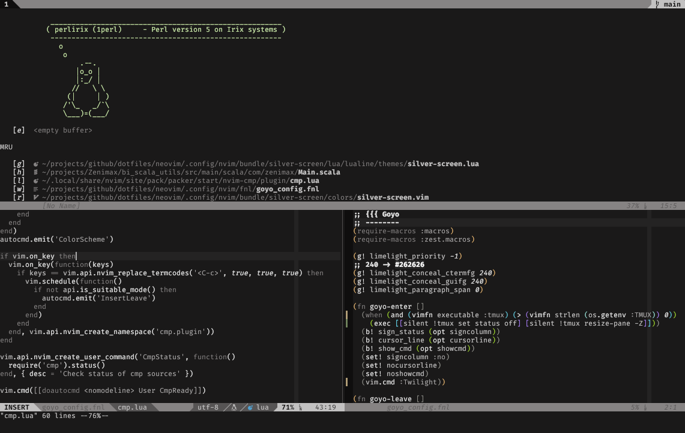

# A minimalist dark, mostly b/w colorscheme



Startify (top), Standard (lower left), Fennel with rainbow parens
(lower right)

## Install

* [packer.nvim](https://github.com/wbthomason/packer.nvim):
```lua
use { 'qfjp/silverscreen.nvim'
    , requires "rktjmp/lush.nvim"
    }
```

* [vim-plug](https://github.com/junegunn/vim-plug)
```vim
Plug "rktjmp/lush.nvim"
Plug "qfjp/silverscreen.nvim"
```

## Design Principles
* Binary/Ternary scheme at most (Positive, Flat, Negative)
* Each group (P, F, N) gets 5 colors each, for 15+1 color scheme
* Colors should be used sparingly
* Boilerplate should fade into the background (low contrast)
* Comments & logic should be visible (high contrast)
